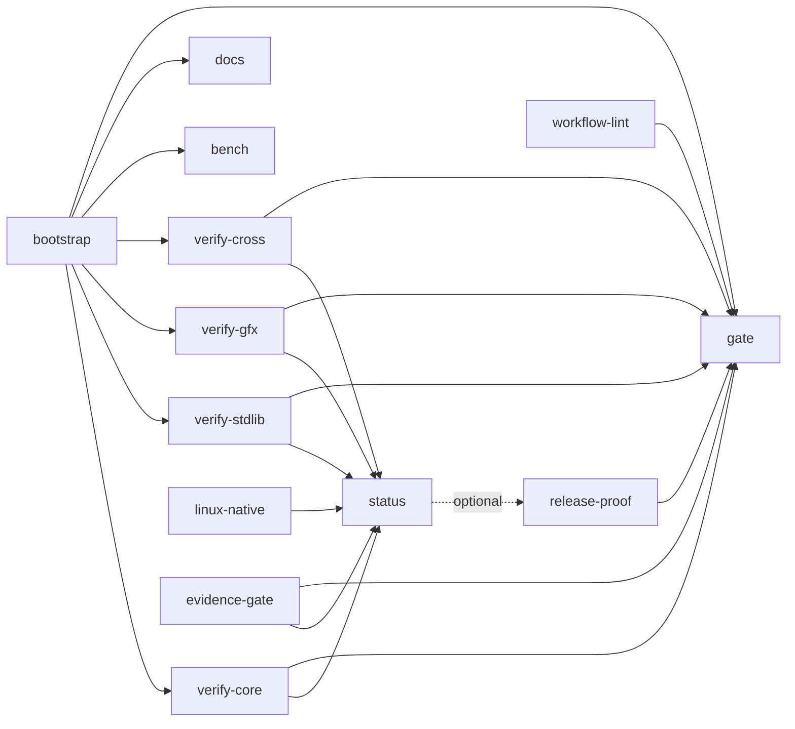

# Continuous Integration (Woodpecker)

The CI runs on a self-hosted [Woodpecker CI](https://woodpecker-ci.org/)
instance. The former GitHub Actions workflow (`.github/workflows/ci.yml`)
has been removed; the configuration now lives in `.woodpecker/`, one
workflow file per lane group (Woodpecker creates one workflow per file and
runs them as a single pipeline with cross-workflow dependencies).
Everything below is operator-facing.

## Layout

| File | Purpose |
|------|---------|
| `.woodpecker/bootstrap.yaml` | stage0(OCaml seed) -> stage1 -> stage2 -> stage3 fixed point (Darwin/aarch64) |
| `.woodpecker/ocaml-seed-health.yaml` | non-blocking OCaml seed development-health gate |
| `.woodpecker/linux-native.yaml` | native Linux x86-64 self-host evidence (from source, ELF) |
| `.woodpecker/verify-core.yaml` | lint/conformance/crypto-kat/verifier/allocator/ABI/atomic/cfg/sweep/doctests/mutation/verifier-stress |
| `.woodpecker/verify-stdlib.yaml` | stdlib integration + Postgres/MySQL native-server lanes + new modules |
| `.woodpecker/verify-gfx.yaml` | gfx-ui, gfx-ui-visual, gfx-ui-gate |
| `.woodpecker/verify-cross.yaml` | arm64 + x86_64 cross-target canary lanes |
| `.woodpecker/bench.yaml` | benchmarks (push to `main` only) |
| `.woodpecker/docs.yaml` | API doc generation + pages-branch publish (push to `main` only) |
| `.woodpecker/evidence-gate.yaml` | generate-then-diff evidence + release-required-jobs set check |
| `.woodpecker/status.yaml` | tested-SHA status snapshot + release evidence |
| `.woodpecker/release-proof.yaml` | TANGERINE RELEASE PROOF (`--gate`) |
| `.woodpecker/workflow-lint.yaml` | `woodpecker-cli lint` over every workflow file |
| `.woodpecker/release-freeze.yaml` | release/** PR permitted-path gate |
| `.woodpecker/gate.yaml` | the aggregate release gate (the one required check) |
| `.woodpecker/wasm-wasi.yaml` | opt-in (manual) wasm/WASI conformance lane |
| `.woodpecker/release_required_jobs.txt` | the machine-readable release-required step set |



`gate.yaml` depends on exactly the workflows that carry a release-required
step; `scripts/check_ci_required_jobs.sh` (run by `evidence-gate.yaml`)
asserts the exact set equality in both directions.

## Required agents and labels

| Lane | Agent label selector | Backend | Why |
|------|----------------------|---------|-----|
| `.woodpecker/bootstrap.yaml`, `ocaml-seed-health.yaml`, `verify-*.yaml`, `bench.yaml`, `docs.yaml`, `wasm-wasi.yaml` | `platform: darwin/arm64`, `backend: local` | **local** | these lanes execute the macOS/aarch64 Mach-O stage3 binary (`build/tg`, `build/tg_stage3`) natively; `verify-stdlib`/`verify-cross` additionally need `nm`/`otool`/`codesign`-class Darwin tooling |
| `linux-native.yaml`, `evidence-gate.yaml`, `status.yaml`, `release-proof.yaml`, `workflow-lint.yaml`, `release-freeze.yaml`, `gate.yaml` | `platform: linux/amd64`, `backend: docker` | **docker** | these lanes run in Linux containers (`amazon/aws-cli`, `python:3.12-bookworm`, `ocaml/opam`, `woodpeckerci/woodpecker-cli`) |

A Woodpecker agent only takes a workflow when **every** label matches, so
the Darwin host must run its agent with the local backend and additional
labels:

```bash
WOODPECKER_BACKEND=local \
WOODPECKER_AGENT_LABELS='platform=darwin/arm64,backend=local' \
woodpecker-agent
```

The Linux host needs a Docker-backend agent with `platform=linux/amd64`
(and the default `backend=docker` label). Because a workflow runs on a
single agent, macOS and Linux steps can never share a workflow — that is
why the config is split per file instead of one mixed `.woodpecker.yml`.

### Darwin host requirements

* macOS 14+ on Apple Silicon, Xcode Command Line Tools (`cc`, `nm`,
  `otool`, `arch` for Rosetta), Homebrew.
* `opam` with the pinned switch from `bootstrap/ocaml-toolchain.lock`:
  `opam switch create 5.4.0 ocaml-base-compiler.5.4.0` (once; the
  workflows install `dune.3.21.1` into it every run — pre-warm the switch
  to keep runs fast).
* `aws` CLI v2 (`brew install awscli`) — the local backend cannot run
  container plugins, so all Darwin-side S3 access is plain `aws s3 cp`.
* Homebrew packages are installed by `verify-stdlib.yaml` itself
  (`openssl@3 libpq postgresql@16 mysql`); the fixed server ports
  (5432/3306) are the reason that workflow is serialized with
  `concurrency: 1`.
* `python3` (system or Homebrew) for the lint lane.
* Optional: `wasmtime` (`brew install wasmtime`) to enable the execution
  sub-lane of `wasm-wasi.yaml`.

### Linux agent requirements

* x86_64 Linux host with Docker; enough disk for the `ocaml/opam` image
  plus the opam switch cache.
* Optional: `WOODPECKER_MAX_WORKFLOWS` > 1 if you want the Linux lanes to
  run in parallel with each other.

## Secrets and operator configuration

Repository secrets (Woodpecker UI → repository → secrets; expose them to
`push` **and** `pull_request` events, otherwise PR pipelines cannot fetch
artifacts):

| Secret | Used by | Meaning |
|--------|---------|---------|
| `s3_access_key` | artifact/cache steps in every workflow | S3/MinIO access key |
| `s3_secret_key` | artifact/cache steps in every workflow | S3/MinIO secret key |
| `docs_publish_token` | `docs.yaml` | write token used to force-push the generated docs to the pages branch |

Non-secret values are inlined per workflow (adjust them once per file);
search for `TG_S3_BUCKET`, `TG_S3_ENDPOINT`, `AWS_DEFAULT_REGION`:

| Setting | Default | Meaning |
|---------|---------|---------|
| `TG_S3_BUCKET` | `tangerine-ci` | bucket for artifacts, caches and the bench baseline |
| `TG_S3_ENDPOINT` | `http://127.0.0.1:9000` | S3-compatible endpoint (MinIO in the reference setup) |
| `AWS_DEFAULT_REGION` | `us-east-1` | region (MinIO ignores it) |
| `TG_DOCS_BRANCH` | `pages` | branch the generated API docs are published to |
| `TG_BENCH_BASELINE_TAG` | `tg-bench-baseline-v1` | prefix of the pinned benchmark baseline object |

Free S3-compatible storage (MinIO) is sufficient — no paid service is
required. One bucket is enough: artifact keys are namespaced by
`<owner>/<repo>/<pipeline-number>/<artifact-name>/`.

## Artifacts, evidence and caches

GitHub artifact upload/download maps to S3-compatible object storage:

* Uploads on the Darwin lanes use the host `aws s3 cp --recursive`
  (the local backend cannot run plugin containers).
* Uploads on the Linux lanes use the pinned `amazon/aws-cli:2.36.44`
  image. The pinned `woodpeckerci/plugin-s3:1.5.4` container plugin is a
  drop-in alternative for the Linux upload steps if you prefer a plugin.
* Downloads (stage3 restore, status snapshot, bench baseline, job-result
  markers) use the same `aws` CLI.

Artifact names mirror the former GitHub artifacts exactly
(`tg-stages-macos-arm64`, `bootstrap-fingerprints`,
`bootstrap-native-tests`, `cross-lane-binaries`, `linux-fingerprints`,
`linux-native-tests`, `mutation-report`, `bench-results`,
`status-snapshot-<sha>`, `release-proof-<sha>`, ...), because
`scripts/release_evidence_schema.sh` validates the artifact set by name.
The `tg-stages-macos-arm64` artifact also carries `build/tg` when
`run_bootstrap.sh` materializes the full driver; the consuming workflows
prefer that binary and fall back to copying `tg_stage3`.

Job conclusions (the former `toJSON(needs)`) are replaced by success
markers: each workflow publishes `build/.ci_results/<job>` to
`ci-results/` only when all of its lane steps succeeded. `status.yaml`
turns the collected markers into `job_results.json`; `gate.yaml` lists
every required job without a marker and fails.

Caching replaces the archived `woodpeckerci/plugin-cache`. The opam/dune
cache is a tar archive keyed by the hash of
`bootstrap/ocaml-toolchain.lock`:

* Darwin (bootstrap / ocaml-seed-health): `~/.opam/download-cache` and
  `~/.cache/dune`, restored/saved with `failure: ignore`; the persistent
  on-host opam switch is the primary cache.
* Linux (linux-native): the whole `~/.opam` root
  (`cache/linux-opam-<lock-sha>.tar.gz`), restored/saved with
  `failure: ignore`.
* The `quay.io/landre/woodpecker/cache` S3-cache plugin is a maintained
  alternative if you prefer a plugin over the tar steps.

## Local execution

[`woodpecker-cli exec`](https://woodpecker-ci.org/docs/usage/local-execution)
runs the workflows from a checkout:

```bash
# lint every workflow file
woodpecker-cli lint .woodpecker/bootstrap.yaml

# run a Linux workflow locally with Docker
woodpecker-cli exec --backend-engine docker .woodpecker/evidence-gate.yaml

# run a Darwin workflow on the local host (requires the host toolchain)
woodpecker-cli exec --backend-engine local .woodpecker/verify-core.yaml

# override metadata to test conditions
woodpecker-cli exec --pipeline-event pull_request --commit-branch main \
  --commit-target-branch main .woodpecker/verify-core.yaml

# secrets are never downloaded from the server
woodpecker-cli exec --secrets s3_access_key="$KEY" --secrets s3_secret_key="$SECRET" \
  .woodpecker/bootstrap.yaml
```

The verifier for the release-required set is runnable standalone:

```bash
bash scripts/check_ci_required_jobs.sh
```

The evidence gates are runnable standalone too:

```bash
bash scripts/gen_status.sh --refresh-manifests && git diff --exit-code -- tests/canary/MANIFEST
bash scripts/gen_feature_registry.sh && git diff --exit-code -- features.toml docs/current/feature_registry.md
bash scripts/gen_spec_docs.sh && git diff --exit-code -- docs/current
bash scripts/check_doctests.sh
bash tests/run_release_evidence_schema_tests.sh
```

## GitHub job → Woodpecker mapping

| GitHub job | Woodpecker workflow | Step | Image / agent | Notes |
|------------|---------------------|------|---------------|-------|
| bootstrap | `bootstrap.yaml` | `bootstrap` | local Darwin | plus 4 S3 upload steps + job-result marker |
| ocaml-seed-health | `ocaml-seed-health.yaml` | `ocaml-seed-health` | local Darwin | non-gated |
| lint | `verify-core.yaml` | `lint` | local Darwin | encoding + control-flow style scripts restored (see Known divergences) |
| bench | `bench.yaml` | `bench` | local Darwin | push `main`; pinned baseline from S3 |
| docs | `docs.yaml` | `docs`, `docs-publish` | local Darwin | Pages → pages-branch push (`docs_publish_token`) |
| conformance | `verify-core.yaml` | `conformance` | local Darwin | 13 command blocks preserved |
| gfx-ui | `verify-gfx.yaml` | `gfx-ui` | local Darwin | `make` targets missing (pre-existing) |
| gfx-ui-visual | `verify-gfx.yaml` | `gfx-ui-visual` | local Darwin | visual diffs uploaded on failure |
| gfx-ui-gate | `verify-gfx.yaml` | `gfx-ui-gate` | local Darwin | final aggregate step |
| evidence-gate | `evidence-gate.yaml` | `evidence-gate` | docker linux, `python:3.12-bookworm` | item-35 check rewritten for Woodpecker |
| status | `status.yaml` | `status` | docker linux, `python:3.12-bookworm` | markers replace `toJSON(needs)` |
| release-proof | `release-proof.yaml` | `release-proof` | docker linux, `python:3.12-bookworm` | runs on failure too (optional status dependency) |
| crypto-kat | `verify-core.yaml` | `crypto-kat` | local Darwin | |
| verifier-projection | `verify-core.yaml` | `verifier-projection` | local Darwin | |
| verifier-stress | `verify-core.yaml` | `verifier-stress` | local Darwin | keeps the mutation-tests step dependency |
| mutation-tests | `verify-core.yaml` | `mutation-tests` | local Darwin | report uploaded unconditionally |
| allocator | `verify-core.yaml` | `allocator` | local Darwin | |
| abi-platform | `verify-core.yaml` | `abi-platform` | local Darwin | |
| atomic-litmus | `verify-core.yaml` | `atomic-litmus` | local Darwin | |
| stdlib-integration | `verify-stdlib.yaml` | `stdlib-integration` | local Darwin | TLS/epoll shims rebuilt, `DYLD_*` preload preserved |
| db-integration-postgres | `verify-stdlib.yaml` | `db-integration-postgres` | local Darwin | Homebrew server on 5432 + always-run stop step |
| db-integration-mysql | `verify-stdlib.yaml` | `db-integration-mysql` | local Darwin | Homebrew server on 3306 + always-run stop step |
| stdlib-new-modules | `verify-stdlib.yaml` | `stdlib-new-modules` | local Darwin | |
| cross-compile | `verify-cross.yaml` | `cross-compile` | local Darwin | Rosetta/qemu preserved; binaries uploaded |
| linux-x86-64-native | `linux-native.yaml` | `linux-x86-64-native` | docker linux, `ocaml/opam:debian-12-ocaml-5.4` | plus upload steps + marker |
| cfg-matrix | `verify-core.yaml` | `cfg-matrix` | local Darwin | |
| stdlib-e106-sweep | `verify-core.yaml` | `stdlib-e106-sweep` | local Darwin | diagnostics uploaded on failure |
| doctests | `verify-core.yaml` | `doctests` | local Darwin | |
| sast (CodeQL) | — | — | — | **not mapped 1:1**: CodeQL's `actions` analysis is GitHub-specific; the config-security role is covered by `workflow-lint` |
| release-freeze | `release-freeze.yaml` | `release-freeze` | docker linux, `python:3.12-bookworm` | `release/**` PRs; changed files from `CI_PIPELINE_FILES`, waiver marker from the commit message |
| workflow-lint | `workflow-lint.yaml` | `workflow-lint` | docker linux, `woodpeckerci/woodpecker-cli:v3.9.0` | actionlint → Woodpecker linter |
| release-gate | `gate.yaml` | `release-gate` | docker linux, `amazon/aws-cli:2.36.44` | marker-based aggregate; runs on success and failure |

## Branch protection (the required-check policy)

GitHub rulesets have no Woodpecker equivalent; the operator configures the
forge's branch protection for `main` with the workflow statuses. The
Woodpecker analogue of the former two required checks is:

* require the `gate` workflow (its `release-gate` step fails when any
  release-required lane produced no success marker);
* optionally require `workflow-lint` separately, exactly as the old
  ruleset required the `CodeQL` context separately.

No admin bypass for ordinary merges remains the documented policy.

## Known divergences and carried-over breakage

* **sast**: dropped (see above).
* **release-freeze**: the PR body is not available to a Woodpecker
  pipeline; the `release-waiver:` marker is read from the HEAD commit
  message and changed files come from `CI_PIPELINE_FILES` (with a
  `git diff` fallback).
* **status**: job conclusions come from success markers instead of
  `toJSON(needs)` (the only way to observe other workflows' results
  without a Woodpecker API token).
* **Pre-existing, not migration artifacts**: the `lint` lane references
  `scripts/check_encoding.py` and `scripts/check_tg_control_flow_forms.py`
  (missing at migration time). Both are now restored: the encoding gate
  rejects invalid UTF-8 and UTF-8 BOMs (the INV-PARSE-002 negative fixture
  `tests/differential/negative/not_utf8.tg` is the one documented
  exception), and the control-flow gate rejects Rust-style brace headers
  and the legacy `continue` alias in favour of the canonical `next`. The
  `gfx-ui` lane's former Makefile gap is also fixed: the root `Makefile`
  defines `test-gfx-ui` / `stub-scan` / `abi-layout-check` / `gfx-ui-test` /
  `gfx-ui-visual` / `gfx-ui-gate` over the real `tg check` / `tg test`
  commands, and `verify-gfx.yaml` invokes them.
* **wasm/WASI**: `tests/run_wasm_conformance.sh` and
  `tests/run_wasi_conformance.sh` existed but were never wired into the
  GitHub workflow; they are available as an opt-in manual workflow
  (`wasm-wasi.yaml`) and are not part of the gate.
